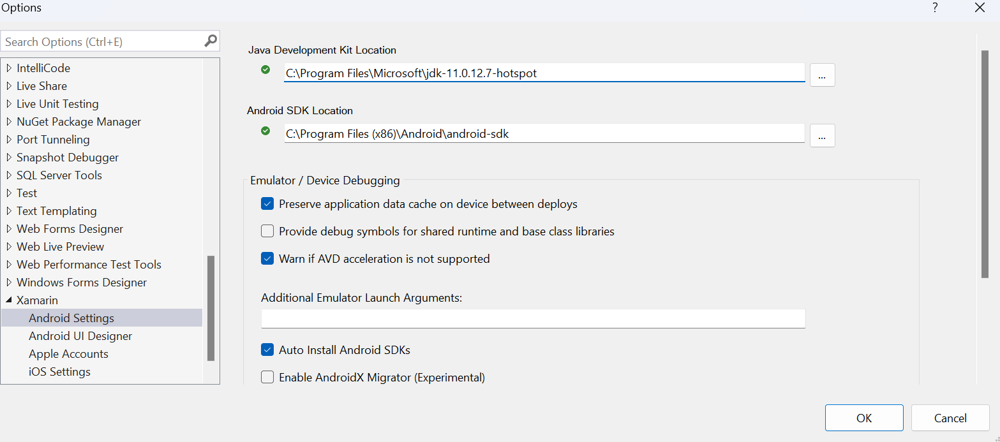

# **.NET MAUI 环境配置技巧**

关于 .NET MAUI 国内小伙伴在配置 .NET MAUI 的时候，遇到不少问题。希望通过本教程，给到大家一些指引。

## **一. 基础组件部分**

### **1. .NET SDK 安装**

建议安装最新的 .NET SDK 

下载地址 https://dotnet.microsoft.com/download/dotnet/6.0 

### **2. 安装 .NET MAUI**


安装 .NET MAUI 成功后，通过 workload 添加 .NET MAUI 的库。.NET workload 可以在 .NET SDK 的基础上安装，安装不同应用场景的支持，如 .NET MAUI ， 如 Blazor 等。你可以通过命令行去的方式，使用 workload 

```bash
dotnet workload install maui
```

**注意：**  

1. Linux 或者 macOS 需要管理员权限，所以需要 sudo

2. 有小伙伴喜欢用 Visual Studio 2022 一站式安装完成，该指引更偏向一步步调整

3. .NET 7 还在 RC 阶段，等发布会同步更新

.NET MAUI 大概每 2-3 周有一个版本的更新，所以建议各位小伙伴执行

```bash
dotnet workload update maui
```

各位可以通过执行以下命令去检查 .NET MAUI 的版本

```bash
dotnet workload list
```


## **二. Android 环境设定**

有部分地区下载 Android SDK 和模拟器是有问题的，我这里说说一些解决办法 

### **1. JDK 安装**

安卓的环境依赖于 JDK ，微软已经把原来的 Adoption OpenJDK 升级到 Microsoft OpenJDK 11 了。

你可以通过 https://learn.microsoft.com/java/openjdk/download  针对 Windows / macOS / Linux 开发平台安装最新的 Microsoft OpenJDK 版本 ， 并配置好 Java_HOME 和 PATH .

在 macOS / Linux 下 , JAVA_HOME , 和 PATH 的配置如下：

```bash

export JAVA_HOME="{你的 Java 安裝路径}/Contents/Home"
export PATH="$JAVA_HOME/bin:$PATH"

```

在 Windows 下 的 Path 配置


### **2. Android SDK 安装**

在 Visual Studio 2022 安装环境装会把 Android Command line tools 和 Android SDK 的最新版本安装好，这是最理想的情况，但如果各位小伙伴遇到网络安装问题，可以参考下面步骤一步步安装。

Android SDK 离线版本下载地址

链接: https://pan.baidu.com/s/1lXRIwLpBaf0UgmvyRJg7BQ?pwd=m1qw 

**配置 Android SDK**

在你的开发环境下，创建 SDK 的存放目录(示例创建目录为 Android/sdk)，在该目录下创建以下文件夹

**注意：** 这里提供 offline 的 Android SDK 包括 31， 32 ，33 分别对应 Android 12 ， Android 12.1 ， Android 13 ， 建议小伙伴都下载安装好


**文件夹介绍**

***a. build-tools - 编译工具***

可以设定不同版本的编译工具

在该目录下，创建以下子目录

build-tools_r31_(对应系统).zip 解压后 重命名为 /31.0.0

build-tools_r32_(对应系统).zip 解压后 重命名为 /32.1.0.rc1

build-tools_r33_(对应系统).zip 解压后 重命名为 /33.0.0


***b. cmdline-tools - 命令行工具***

命令行文件

基于不同平台解压，重命名为 7.0 ，把所有文件直接放在 cmdline-tools 文件夹内


***c. emulator - 模拟器可执行文件***

直接基于你的平台解压放置该文件夹内即可


*这里一定要记得一点，需要把 package.xml 授权文件放进去，否则你没有办法从 Visual Studio 中开启模拟器*

***d. platform-tools - 平台相关的命令行工具***

直接根据平台解压完成即可


***e. platforms - android sdk***

直接解压文件

platform-31_r01.zip 解压后重命名为 android-31

platform-32_r01.zip 解压后重命名为 android-32

platform-33_r02.zip 解压后重命名为 android-33

***f. system-images - 模拟器镜像***


这个解决的是可以帮你构建离线镜像，这里我提供了 Google API 的 x86_64  和 arm64 位的镜像

如 Android 13 的模拟器对应的就是我的 33 文件夹

在该目录下，创建 android-33 ， 继续创建该文件夹的子文件夹 google_apis, 并根据平台的架构 x86_64 或者 arm64_v8a 创建对应的子文件夹 ，如我是 apple silion ，就是 arm64_v8a 


***g. patcher ***

创建子文件夹 v4 ，解压 zip 包把文件放置在v4 文件夹内，并把 package.xml 同时放置在 v4 文件夹


**也可以安装 WSA 作为安卓的模拟环境：** https://learn.microsoft.com/en-us/windows/android/wsa/

*模拟器运行，如果你是 X86_64 架构，请开启 Intel HAXM*  https://github.com/intel/haxm 


## **三. iOS 环境设定**

最新的 Xcode 是需要安装的（因为 Xcode 14 刚发布， .NET MAUI 还没有完整支持，请使用 Xcode 13.4.1）

下载 Xcode 13.4.1 

链接: https://pan.baidu.com/s/1libEvYE752lVJKV5Q-j_NQ?pwd=sf2p 

macOS 是支持多 Xcode 的开发环境的，如图 


安装完 Xcode 后记得配置好 Visual Studio 的路径


也可以通过命令行设定默认的 Xcode，这里建议选择默认为 Xcode 13.4.1

```bash

sudo xcode-select -s <path/to/>Xcode.app(Xcode 13.4.1)

```

把环境变量设置好 

macOS / Linux 下

```bash

export ANDROID_HOME="/Users/luk/Tools/Android/sdk"

export PATH="$PATH:$ANDROID_HOME/platform-tools"
export PATH="$PATH:$ANDROID_HOME/emulator"
export PATH="$PATH:$ANDROID_HOME/cmdline-tools/7.0/bin"

```

Windows 下的配置


**关于 Windows Remote**


现在 Windows 是要远程连接 macOS 的设备，才能启用模拟器和真机的，所以大家必须有一台 Mac 系列的相关设备，这里我建议大家用 macOS 云端的解决方案，节约一下成本

https://www.macincloud.com/ 

还有必须 Windows 和 macOS 上的版本统一否则会有版本不同步出错的情况。


## **四. 在 Visual Studio 设定好相关的路径**

在 Visual Studio 2022 设定好 iOS 和 Android 的配置路径这是最后一步

**macOS 路径设定**

Xcode 的路径配置 Perferences -> SDK -> Apple


Android 的路径配置 Perferences -> SDK -> Android -> Locations


**Windows 路径设定**




## **小结**

.NET MAUI 的配置问题不是出于 .NET 本身更多是出现在 Android 和 iOS 的环境配置上，特别 Android SDK 会根据地区和网络供应商的设定而变。希望该内容能帮到各位在 .NET MAUI 环境安装遇到困难的小伙伴。


