# **.NET MAUI in GCR 月报-202208**

.NET MAUI 正式版本发布已经三个月了，有小伙伴希望我们有一些关于 .NET MAUI 相关的本地化内容以及开源项目介绍，接下来从8月开始，我希望用月报的形式和大家分享 .NET MAUI 在中国的活动，学习资源，优秀的开源项目，以及一些社区相关的内容，希望给到中国开发者能快速掌握 .NET MAUI 的最新资讯。

## **.NET MAUI Developer Day in GCR**

 

在 7 月我们在大中华地区启动了 .NET MAUI Developer Day in GCR ,希望能把 .NET MAUI 的技术做一个整体的介绍，包括大中华区开发者关心的相关概念，控件构建，性能，应用场景，以及开发经验都分享给大家。这里要感谢 Microsoft .NET MAUI 团队的同事，他们帮我们制作了非常棒的线上内容。当然也感谢我们 Microsoft MVP 团队，大家知道我们 .NET MAUI 的前身就是 Xamarin ，在过去就有不少大中华区的 Microsoft MVP 在项目中使用 Xamarin 和在所在城市组织社区。本次活动我们有 9 位的开发者为大家提供了从架构，开发，产品等的经验。下面我来和大家一起回顾一下精彩的时刻

**Keynote Session 《 .NET MAUI 介绍 》**- David Ortinau

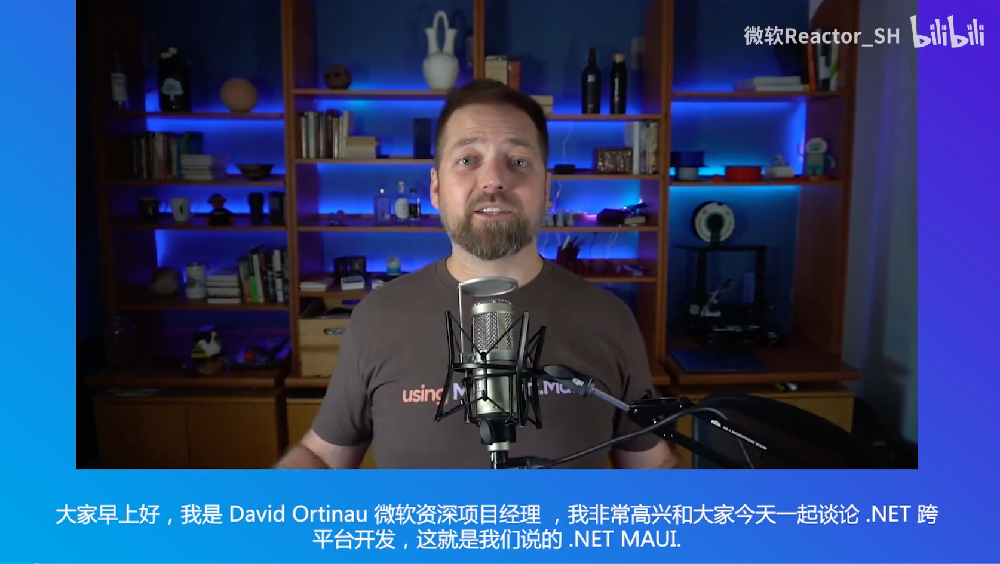
 

David Ortinau 相信很多关注 .NET MAUI 的小伙伴都听过他非常精彩的 .NET MAUI 内容分享，这次的 Keynote Session 也由他来进行分享。本次 David 分享了 .NET MAUI 的基础知识外，还分享了在 Visual Studio 2022 的开发技巧，以及构建 UI 时的开发体验，如果小伙伴希望回看该内容，从访问 Microsoft Reactor 的 B 站频道 -  MAUI Developer Day in GCR-上午专场  https://www.bilibili.com/video/BV1oT41157En  (00:06:30 - 00:49:47) 
 
 

**Keynote Session 《 用多种方法创建自定义 .NET MAUI 控件 》**- Javier Suárez Ruiz

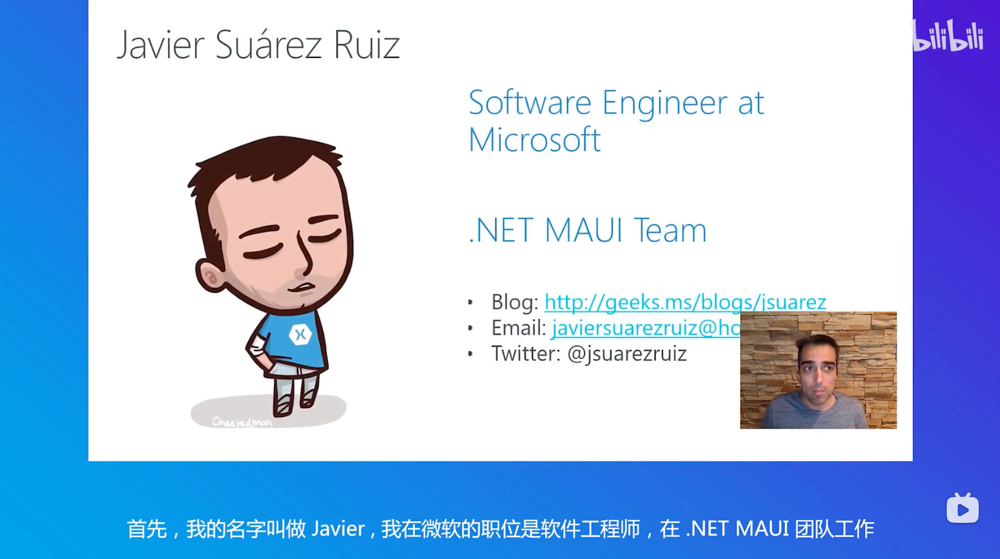
 

.NET MAUI 让你可以通过代码或 XAML 的方式构建跨平台的 UI 。有不少小伙伴就对如何定制 UI 的方式感兴趣 ， Javier 就用了 5 种不同的方法为大家介绍了自定义的 .NET MAUI 控件。不仅兼容就有的 Xamarin 自定义控件方式，也可以通过全新的 ViewHandler , ContentView , TemplateView 的方式创建，当然也少不了自绘方式的 GraphicesView ，如果你希望重温该内容可以访问 Microsoft Reactor 的 B 站频道 -  MAUI Developer Day in GCR-上午专场  https://www.bilibili.com/video/BV1oT41157En  (1:05:45 - 1:48:59) 
 

**Keynote Session 《 .NET MAUI 中的性能改进 》**- Jonathan Peppers

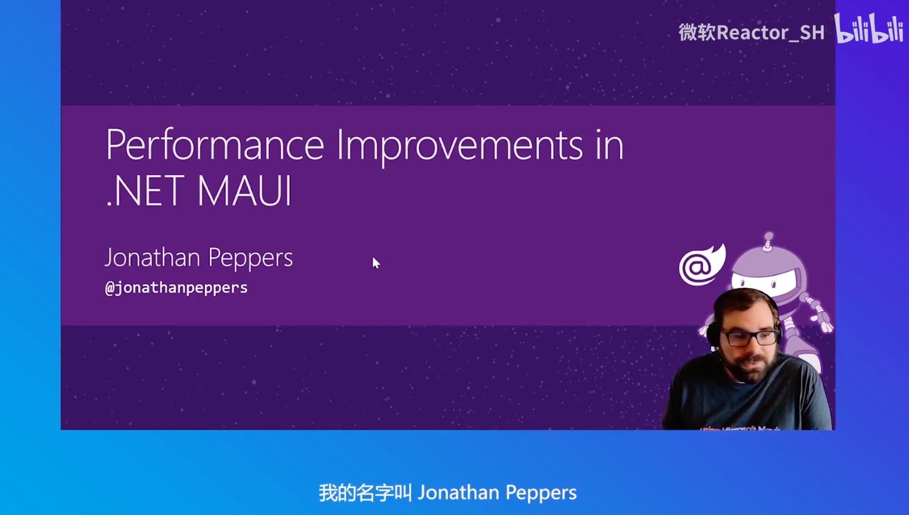
 

大家在决定采用 .NET MAUI 的时候一直在担心 .NET MAUI 的性能问题， 在 Xamarin 的时候就有小伙伴说启动 Xamarin 的应用有点慢。这次我也邀请到了 .NET MAUI For Android 团队的 Jonathan 为大中华区的开发者提供精彩的 .NET MAUI 性能分享，不仅分享了 .NET MAUI 优化性能的故事，构建 .NET MAUI 应用性能提出了不少的建议 ，以及利用工具监测 .NET MAUI 性能的技巧。如果你希望重温该内容可以访问 Microsoft Reactor 的 B 站频道 - MAUI Developer Day in GCR-上午专场 https://www.bilibili.com/video/BV1oT41157En (1:53:52 - 2:34:46)
 

**Keynote Session 《 Uno Platform 介绍 》**- Nick Randolph

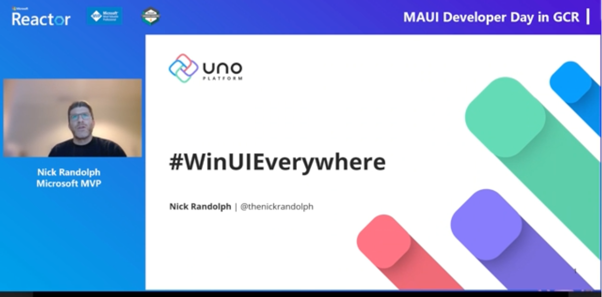
 

在国内一直有小伙伴说 .NET MAUI 不能生成 Windows 7 的应用 ，还有小伙伴希望 .NET MAUI 能够官方支持 Liunx 。为了解决 .NET MAUI 现阶段现有场景的一些缺陷，我邀请了 Uno Platform 团队的 Nick 来分享了 Uno 开发的一些事，如果大家感兴趣，可以先用用 Uno 的方案 。大家可以访问该链接 https://live.csdn.net/room/MicrosoftReactor/SaMA50JC (03:04:14 - 03:43:53 )
 

**分会场内容**

在下午的分会场，主要针对应用案例，开发技巧，以及行业案例三个主题展开 ，希望能够通过 GCR 的 .NET MAUI / Xamarin 专家给各位小伙伴提供一些经验。这里鸣谢 Microsoft MVP 团队，谢谢你们一直在推广 .NET MAUI 这个技术。如果各位感兴趣可以访问 Microsoft Reactor 的 B 站频道 - MAUI Developer Day in GCR-下午专场 https://www.bilibili.com/video/BV1gF411A7wC 
 

## **.NET Conf: Focus on MAUI**

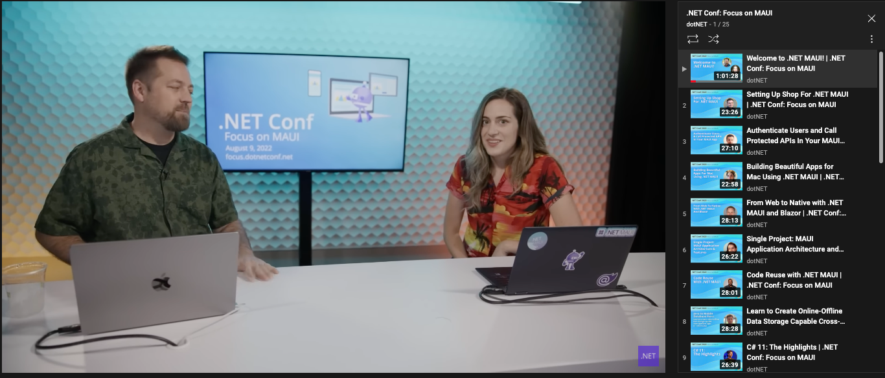
 

在 8月 9 日我们迎来了 .NET Conf: Focus on MAUI , 这是 .NET MAUI 的全球活动， 微软希望通过这个活动能够让更多的开发者能够学习 / 使用 .NET MAUI 。建议各位感兴趣可以访问一下，里面有非常多的 .NET MAUI 团队分享的内容(当然也有我本人的课程，说说英文，希望大家感兴趣)，回看的链接在这里 https://www.youtube.com/watch?v=zp3Ja-jAjq4&list=PLdo4fOcmZ0oWePZU3W162NJ9vcXqgpMVc 

这里我推荐几个比较有趣的课程给到大家，

**《 Upgrade your JS App to Native with .NET MAUI 》** - Alyssa Nicoll

 

如果你希望通过结合 WebView 做相关的混合式应用，你可以听听这个课程。https://www.youtube.com/watch?v=L5u6ImX6MfY&list=PLdo4fOcmZ0oWePZU3W162NJ9vcXqgpMVc&index=17 
 

**《 .NET Community Toolkit 8.0 - MVVM Goodness for .NET MAUI 》** - Sergio Pedri

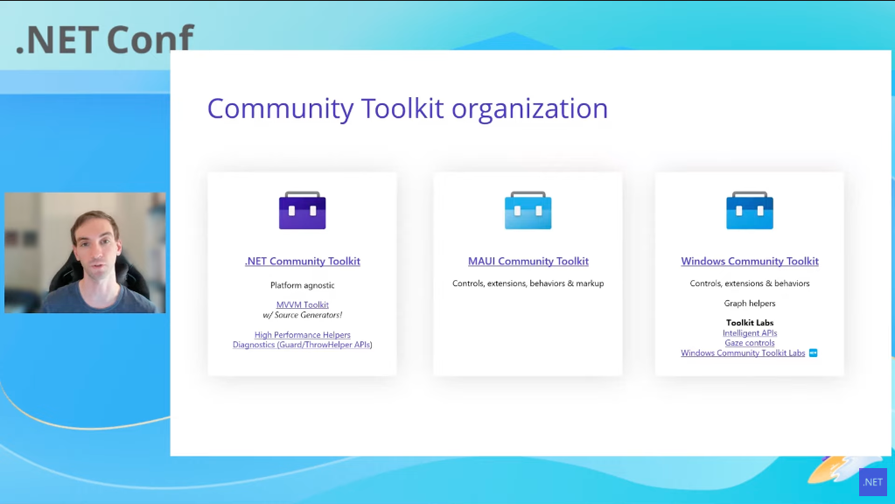
 

如果你是一个 WPF / Xamarin 开发者你不会不知道 MVVM 的应用架构方式，现在微软发布了 .NET Community Toolkit 8.0 , 它可以帮助你在 .NET MAUI 上快速搭建 MVVM 的框架，https://www.youtube.com/watch?v=OP9g5dM0bgk&list=PLdo4fOcmZ0oWePZU3W162NJ9vcXqgpMVc&index=22 
 

**《 Error monitoring for .NET MAUI with Sentry 》** - Matt Johnson-Pint 

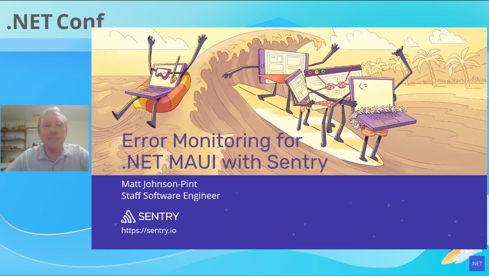
 

错误信息的管理是老生常谈，这个 session 或者是一个非常非常好的答案，希望各位用心看看 https://www.youtube.com/watch?v=RW3hiukVXZQ&list=PLdo4fOcmZ0oWePZU3W162NJ9vcXqgpMVc&index=23 
 

**《 Binding Native Libraries for .NET MAUI 》** - Kinfey Lo

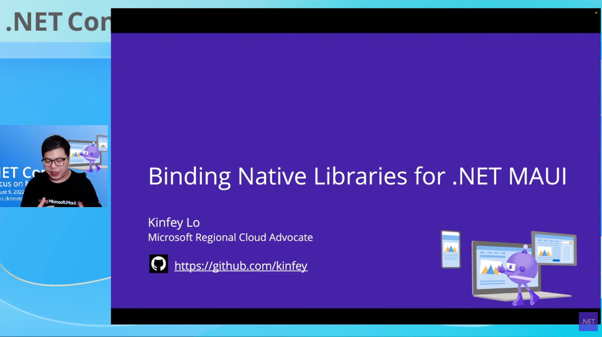
 

关于原生库绑定，这也是一个有趣而且重要的话题，当然这是本人的课程，大家耐心看看(我的 Chinglish) https://www.youtube.com/watch?v=oibfI-ZsmzQ&list=PLdo4fOcmZ0oWePZU3W162NJ9vcXqgpMVc&index=19 
 
 

## **.NET MAUI Workshop 本地化**

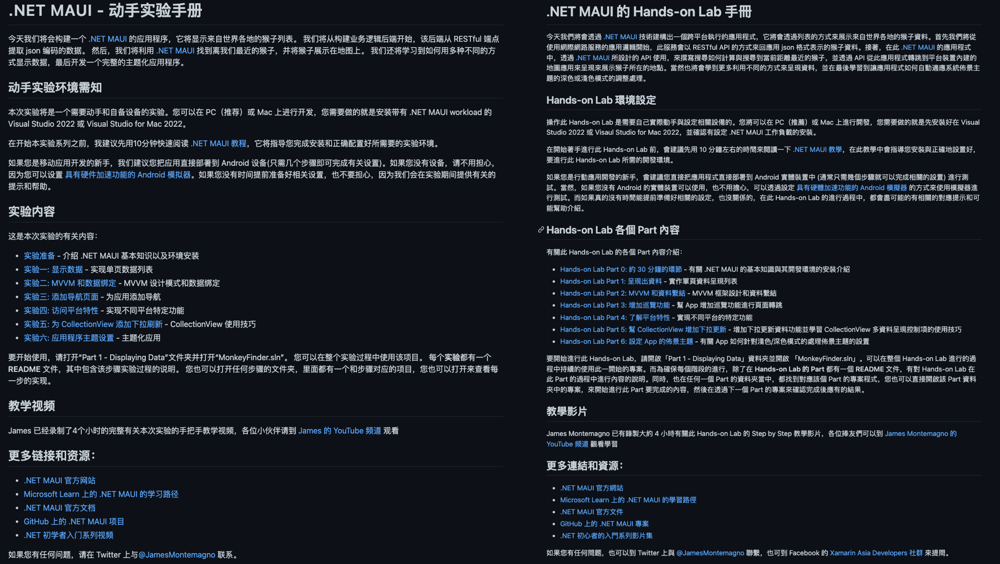
 

一直希望做一点国内的 Workshop ，在官方的文档上，有不错的 .NET MAUI Workshop , 和 .NET MAUI 团队提出要汉化这些内容，也是为了让更多人更快上手 .NET MAUI 。 特别是给到一些本来就是 WPF / Xamarin 的开发人员提供一些好的内容。这次特别感谢台湾的 Microsoft MVP 协助我一起把 .NET MAUI Workshop 做了汉化的工作。如果各位小伙伴或者团队希望学习 .NET MAUI 大家可以访问该地址获取简体(https://github.com/dotnet-presentations/dotnet-maui-workshop/blob/main/README.zh-cn.md)或者繁体(https://github.com/dotnet-presentations/dotnet-maui-workshop/blob/main/README.zh-tw.md)的内容。 
 

## **.NET MAUI 学习资源**

**.NET MAUI 入门教程**

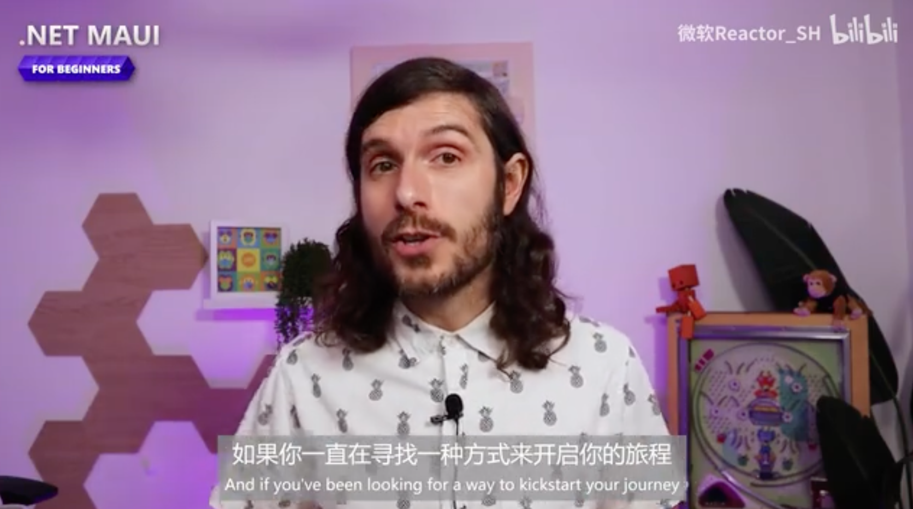
 

James 的 .NET MAUI 入门课程已经有汉化啦，大家可以访问 Microsoft Reactor 的 B 站 https://www.bilibili.com/video/BV1cT411L7U4 
 

**.NET MAUI 跨平台应用开发**

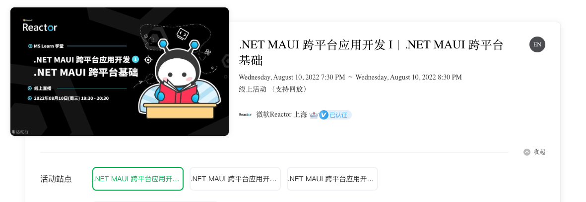
 

我8月每周三的 .NET MAUI 入门系列，大家感兴趣多多支持 https://mstfreactor.huodongxing.com/event/6660904782923 
 

**.NET MAUI 跨平台开发合集**

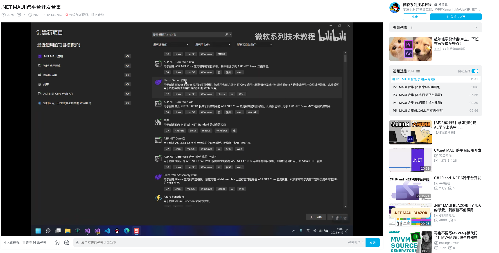
 

这是 Microsoft MVP 周豪的线上课程，大家可以去他的 B 站学习 .NET MAUI https://www.bilibili.com/video/BV1VW4y1k7Bk  
 

**.NET MAUI 使用原生库技巧的教程**

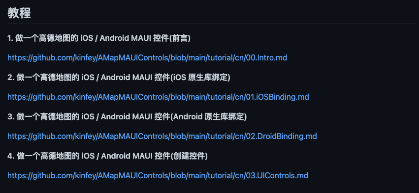
 

如果你希望进阶使用 .NET MAUI，绑定 iOS / Android 的原生库是必不可少的，我写了一个系列给大家，希望对大家在项目中有所帮助 https://github.com/kinfey/AMapMAUIControls 
 

## **展望**

.NET MAUI 在 GCR 的发展少不了社区的支持，在 GCR 地区每天都有基于 .NET MAUI 的内容，希望通过该月报，可以为社区小伙伴整理 .NET MAUI 的相关内容。还有如果你们有 .NET MAUI 的项目上线了，也可以和我联系。希望能让 .NET MAUI 在 GCR 有更好的发展。

